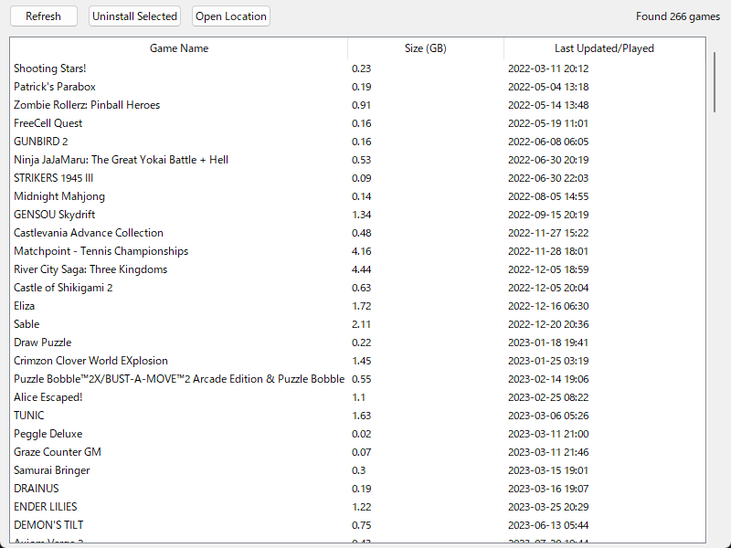

# Steam Game Manager

A simple tool to help you identify and uninstall installed Steam games that you haven't played in a while.

## How to Run

Double-click `run.bat` to start the application.

## Features

### 1. Game List
- Displays all installed Steam games.
- Shows size and "Last Updated" date (which acts as a proxy for last played time).
- By default, games are sorted by Last Updated date (Oldest first), helping you find unused games.

### 2. Sorting
- Click "Size (GB)" column header to sort by size.
- Click "Last Updated/Played" column header to sort by date.

### 3. Uninstall
- Select games you want to remove (Hold Ctrl or Shift to select multiple).
- Click "Uninstall Selected".
- This opens the official Steam uninstall dialog for each selected game. Follow the prompts in Steam to finish.

### 4. Open Location
- Select a game and click "Open Location" to open its installation folder in File Explorer.

## Requirements

- Python 3
- "vdf" library (installed via `pip install -r requirements.txt`)
